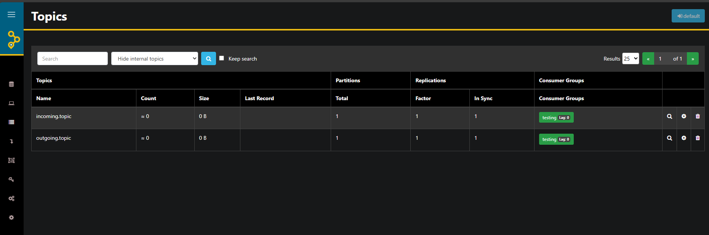

# AKHQ

To see what is inside your Kafka, you can use AKHQ running on [http://localhost:9000](http://localhost:9000) in debug mode only.

Since that there is only one kafka cluster there is no need to do any extra steps, just open akhq and check your topics

