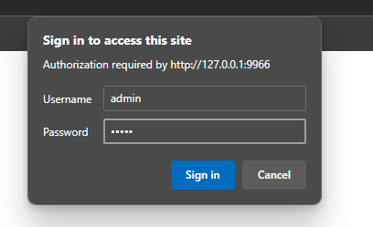
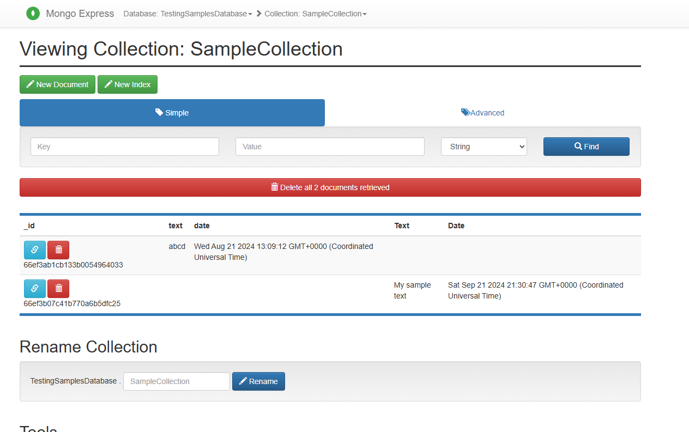

# Mongo Express

To see what is inside your Mongo, you can use Mongo Express running on [http://localhost:9966](http://localhost:9966) in debug mode

## Login

| Prop | Val |
|-|-|
| Username | admin |
| Password | pass |

## Browse this tool

