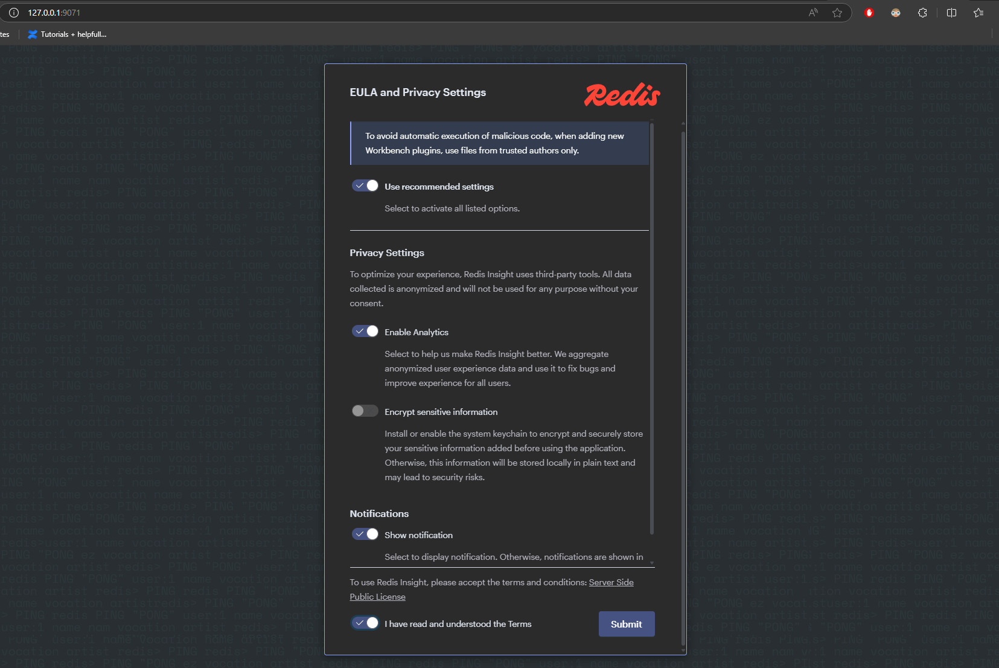
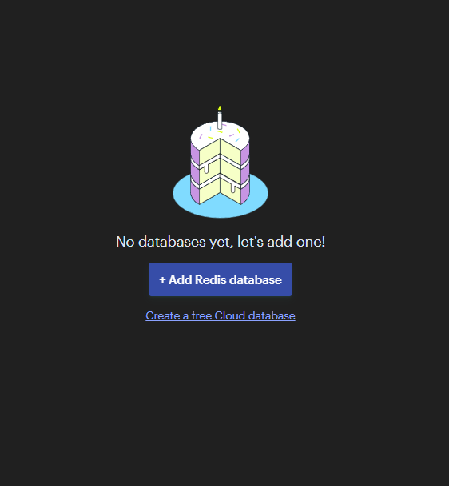
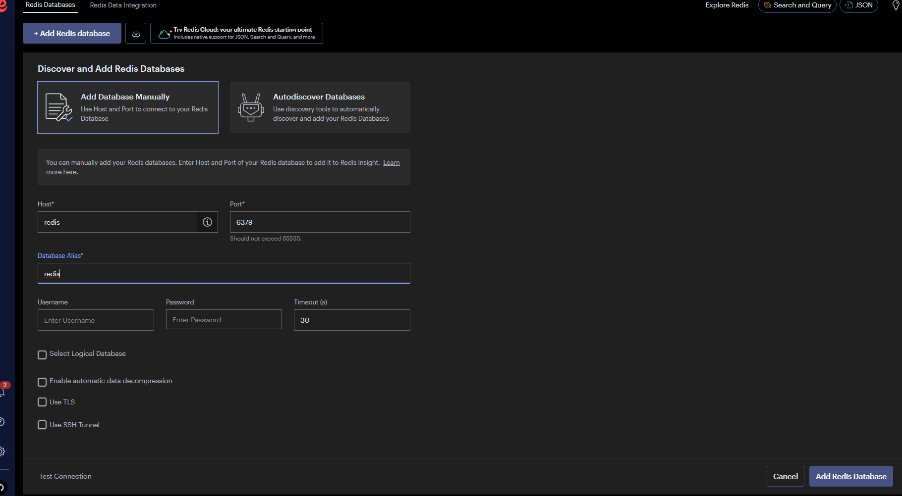

# RedisInsight

To see what is inside your Redis, you can use RedisInsight running on [http://localhost:9071](http://localhost:9071) in debug mode

> ### !! Container has mount, but for first run you will have to setup this tool as described bellow !!

Confirm EUAL

Add DB

Connect

