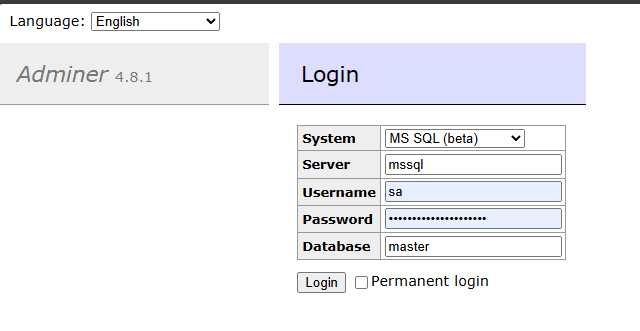
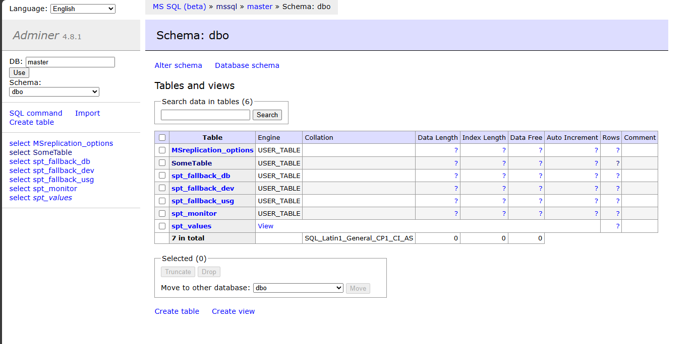
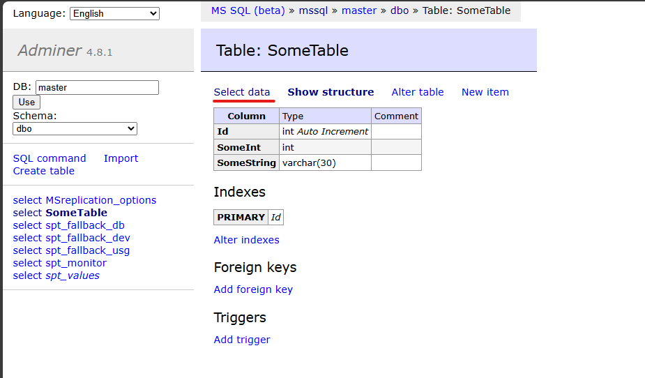

# Adminer

To see what is inside your SQL project, you can use Adminer running on [http://localhost:8080](http://localhost:8080) in debug mode only.

## Login

| Prop     | Val                |
|----------|--------------------|
| System   | MS SQL (beta)       |
| Server   | mssql              |
| UserName | sa                 |
| Password | Strong(!)Password   |
| Database | master              |

## Select table

Click on the table you want to browse.

## Select from table

